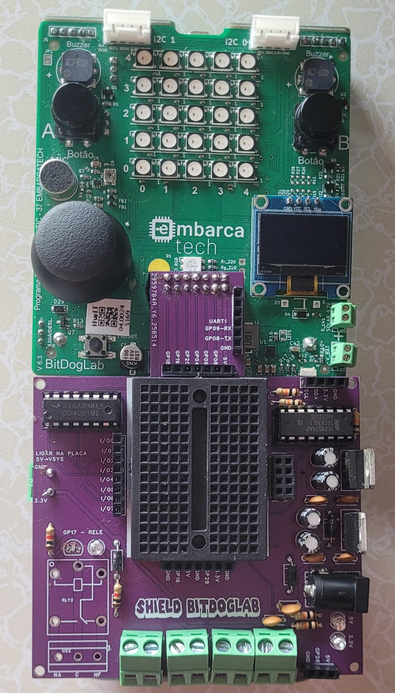

# Shield Para a Placa BitDogLab

O Shield BitDogLab foi projetado para ampliar significativamente
as funcionalidades da placa BitDogLab. Com foco em versatilidade,
este Shield oferece expansão de entradas e saídas digitais e
analógicas, controle de motores DC, facilidade de programação via
conversor USB-TTL, e suporte a prototipagem rápida com mini
protoboard integrada. Além disso, inclui um relé de 5V, ideal para
acionamento de cargas externas com segurança e isolamento.

